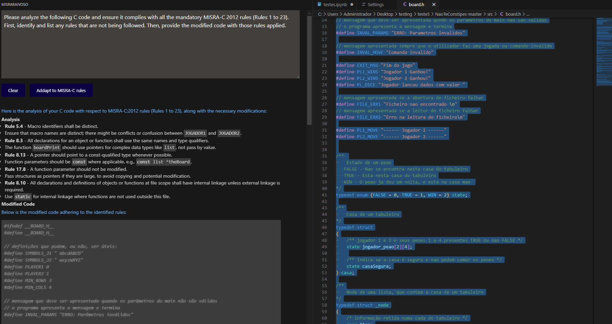

 # TFC-DEISI2-Modelo-IA-para-MISRA-C
## Modelo-IA-para-MISRA-C

## Texto e imagem para apresentação e divulgação do trabalho
Neste trabalho, realizamos uma análise comparativa entre os modelos GPT-4 e GPT-4O na aplicação das regras MISRA-C 2012, essenciais para garantir a qualidade e segurança do código C. Utilizando métricas de precisão, recall e outras, avaliamos o desempenho dos modelos na detecção e correção de violações das regras. As melhorias sugeridas incluem a otimização de prompts e a inclusão de uma maior variedade de exemplos de código para aprimorar a eficácia dos modelos. Este estudo visa proporcionar uma abordagem mais robusta e precisa na conformidade com as normas MISRA-C, contribuindo para o desenvolvimento de um plugin.

## Features

- **With right click** 🖲️
    - You can ask any question to chatgpt `Ask ChatGPT`
    - With this option `ChatGPT: misracrules` you can change the prompt too on the settings
    - This option is a generic cannot be change `Addapt to MISRA C rules Command`

## Installation

### Requirements
- Install node.js from [here](https://nodejs.org/en/download)
- Open the folder in visual studio code.

### Steps
1. Delete the following folders if they exist: `dist`, `node_modules`, and `chatgpt-plus-misra-c-1.0.2.vsix`.
2. Open the terminal and execute the following commands:
    - `git add .`
    - `git commit -m "First Commit"`
    - `git push origin main --force`
    - `npm install -g vsce`
    - `npm install`
    - `npm run compile`
    - `vsce package`
3. Click all these `ctrl+shift+x` 
4. Click on the top right where is this `...`
5. Click on the option `Install from VSIX...`
6. Choose the file `chatgpt-plus-misra-c-1.0.2.vsix`
7. Close and open visual studio code 
8. Go to settings 
    - option `>Extensions`
    - option `CHATEXPLORER` 
    - put your api key

# video
https://youtu.be/46Zp5LWldPQ
